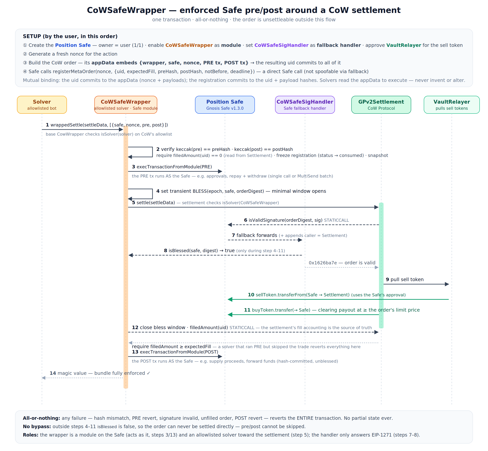
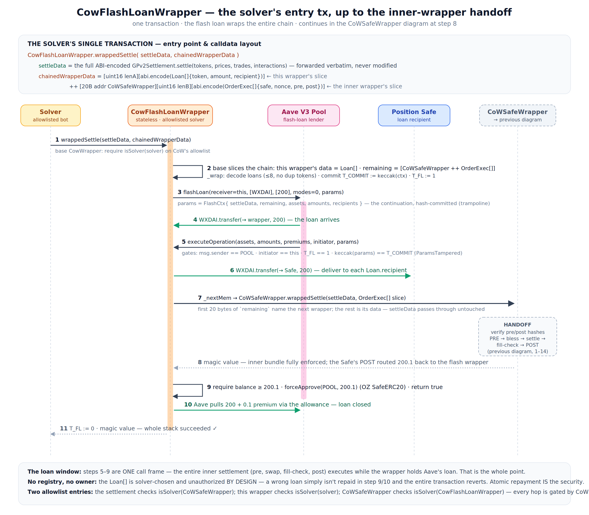

# Sequence diagrams

## `CoWSafeWrapper` — enforced Safe pre/post around a CoW settlement

The setup (Safe creation → nonce → appData-committed order → `registerMetaOrder`) and the full atomic
execution (verify hashes → freeze → PRE → bless → settle → EIP-1271 via the handler → fill-proof → POST).

## `CowFlashLoanWrapper` — the solver's entry transaction

The outer entry point and how the chain nests: solver → flash wrapper (trampoline-commits the context)
→ Aave `flashLoan` → `executeOperation` (hash-check params → deliver loan → hand off to `CoWSafeWrapper`
→ … → `settle`) → repay. Ends at the hand-off where the diagram above takes over.

*(SVG sources alongside the PNGs are editable.)*
